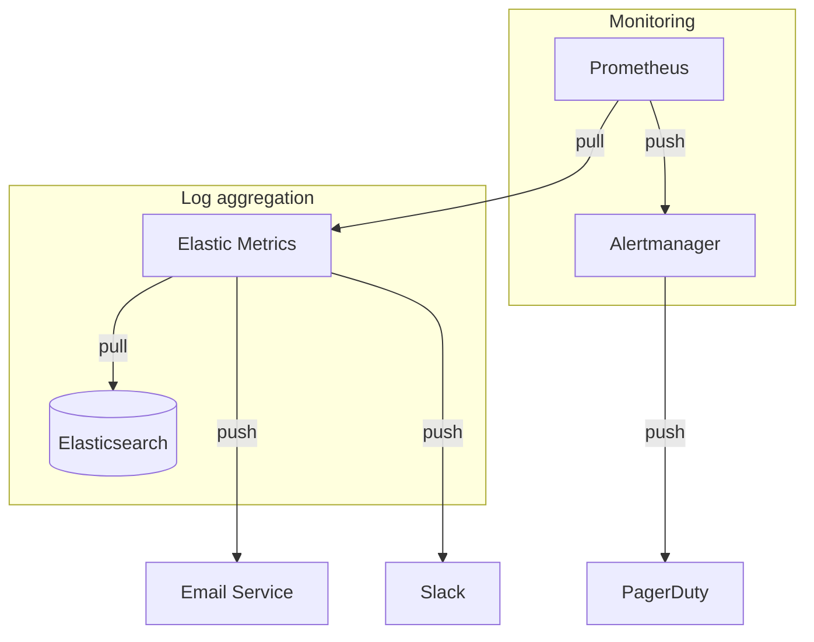
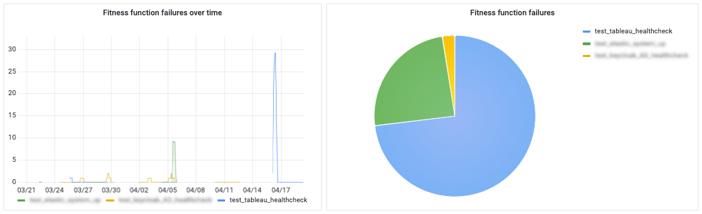
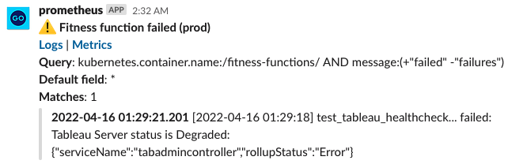
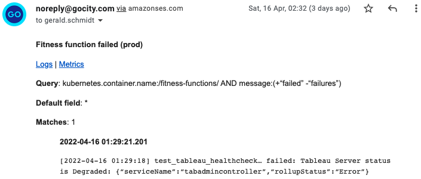

# First responder's guide to log alerts

If, like so many teams, you have taken great care setting up monitoring and alerting based on metrics, you may have asked yourself whether it is necessary to alert on log data as well. Time series data lends itself to alerting in an immediate way that the vast, untidy mass of text that makes up our logs does not. "Metrics are cheap," the [Zen of Prometheus](https://the-zen-of-prometheus.netlify.app/) reminds us, and "if you can log it, you can have a metric for it." I do not wish to play down the importance of operational alerts based on time series data in any way, but I do think there are use cases for log-based alerts that strongly suggest alerting on both.

Tracking the proportion of 5xx and 2xx response codes in Prometheus is clearly preferable to dissecting each and every log line produced by the ingress tier. We may choose to alert when the share of 2xx dips below 99.8 per cent, for example, and the Grafana panel almost builds itself - or it would do if nginx didn't already come with a full dashboard more refined than any we are likely to build ourselves.

What makes response codes such a good fit is the small number and clarity of the signals we are working with. Server response codes may be as good a match for time series databases as we can find, though boolean expressions such as the "up" metric come a close second. Many operational issues are less tidy. Some error conditions are intelligible only in text form (as when a service logs an error message explaining what it tried and failed to do) and others are not readily available in metric form (Kubernetes cluster events are a good example of this). From a monitoring perspective, there is one specific problem that a time series database such as Prometheus is ill equipped to solve: conditions requiring high cardinality labels such as error or status messages.

The goal is to create alerts that are both timely and expressive. For the business, timeliness is the top priority. The first responder is notified, investigates the issue and remedies any faults if necessary. Expressiveness of alerts is key to preserving the first responder's sleep: an expressive alert allows phone triage and reduces the number of times first responders get out of bed for alerts that can wait. Anyone who spends a lot of nights on call will recognise the value of knowing in advance whether a given alert is worth getting up for.

## The proposed approach

This blog post describes a very simple glue service we have built to join up Elasticsearch and Prometheus on the one hand, and Slack, PagerDuty and email on the other.



## Build, buy or deploy open source with a drop of glue

The field of observability is blessed with a wide range of amazing managed services. Datadog is an outstanding product. So are Sumo Logic, Splunk and Honeycomb, not to forget less dominant market participants such as Instana. Why, given I have huge admiration for these products, am I not pushing for a buying decision?

One fundamental issue with log aggregation "Software as a Service" (SaaS) offerings is that we agree a data limit at the start, which we then struggle to stay below. This can create a perverse incentive to "log less" or disable log aggregation for certain applications. The worst case scenario is forgoing logs in pre-production environments altogether, effectively committing the business to testing its log alerts in production. The problem is not that these services aren't good value, but that the cost can be unpredictable. Having gone cap in hand a number of times to request an increased volume allowance, this is a model I am keen to avoid.

Above all, however, the proposed solution is not a case of build, but of open (or substantially open) source with a thin glue layer. The heavy lifting is done by Prometheus and Elasticsearch. Both work well using first-party operators, and both, in AWS at least, offer managed versions with cloud vendor support should the business outgrow its in-cluster monitoring and log aggregation stack.

What are we looking at building, then? A thin glue layer that binds these services together. If it fails, logs continue to be collected, and metrics continue to be registered. We are connecting one mature, well-maintained system to another. The idea is to achieve a high level of integration and customisation without taking on a large or complex codebase.

## Log alerts as code
Developers configure log-based alerts in plain YAML. They query Elasticsearch much as they would do from the Kibana user interface (in that the query language is Lucene). They determine how much or how little information is pushed to Slack and email (if either). They are free to set up higher-level alerts by configuring Prometheus rules. Elastic Metrics might report on a regular expression match in a log produced by a given pod in a given namespace, but the developer decides how many of these have to occur in a given time frame to warrant waking up the first responder.

Here is a simple example of one such alert:

```yaml
queries:
  - label: "Fitness function failed (prod)"
    luceneQuery: 'kubernetes.container.name:/fitness-functions/ AND message:(+"failed" -"failures")'
    defaultField: "*"
```

This query will alert on any fitness function that fails in the production cluster. Our chosen approach is a service "fitness-functions" running in the cluster.

The regex notation for the container name is a convenient shorthand because it always describes a full field (in effect Elasticsearch treats it as `/^fitness-functions$/`). The label is used as a time series label, Slack heading and email subject. Teams specify their own queries, which are validated on startup.

One example of such a log line is:

```
[2022-04-16 01:29:18] test_tableau_healthcheck… failed: Tableau Server status is Degraded: {“serviceName”:“tabadmincontroller”,“rollupStatus”:“Error”}
```

As a first responder responsible for Tableau, this is an immediate warning signal. When `tabadmincontroller` fails with status `Error`, the server is likely to follow. (`vizqlserver` flagging `Degraded` service is more likely to be a momentary blip.) Sure enough, the next time the fitness function runs, it reports:

```
[2022-04-16 01:39:18] test_tableau_healthcheck… failed: Tableau Server status is null:
```

There is no response, no JSON payload of any sort to report back.

In the eyes of Prometheus, these matches increment counter `elastic_metrics_total`:

```
elastic_metrics_total{
  function="test_tableau_healthcheck"
} 2
```

Note that the counter contains very little information. It allows Prometheus to show how many times a given fitness function failed. This is useful if we wish to draw a pie chart of the relative prominence of fitness function failures due to Tableau health checks:



It could also highlight an upward trend or a spike in the rate of increase. There are no high cardinality labels. There is certainly no indication that Tableau Server reported its status as "Degraded" or that it is the "tabadmincontroller" component that appears to have triggered the alert.

The Prometheus counter will wake up the first responder, but it offers little of value when it comes to determining the severity of the issue.

Instead of trying to squeeze expressive detail into Prometheus labels, we open additional alert channels that are better suited to high-cardinality signals such as lines of text: Slack and email.

## Slack
If I specify a team name (e.g. `platform`) in the alert configuration, Elastic Metrics will push matching log messages to the appropriate Slack channel. This is how the alert mentioned earlier appeared in Slack:



We are using the webhook already set up for our Prometheus alerts, which has the advantage that the matching Alertmanager notification (and, eventually, the first responder's resolution note) appears alongside this alert. This multi-pronged approach is deliberate: PagerDuty only needs to know when to wake us up and which system, generally speaking, is impaired; details are much better conveyed in a text-focused medium such as Slack or email.

If we specify a fully qualified domain name for Kibana, the alert features a hyperlink `Logs` that takes the user to the log match in context. The `Metrics` link takes the user to the matching graph in Prometheus. If neither is installed or configured, the service would still happily notify Slack and/or email. The goal is to connect as many tools as possible without requiring any of them to be installed or available. The only firm dependency is Elasticsearch, without which there is no data source for the service to query.

## Email
The email notification looks very similar:



The alert is sent to any email address specified in the `recipients` list. If there is no suitable email service running in the cluster – our implementation is fairly minimal and takes only subject, markdown for the message body and the list of recipients – the `recipients` property can be omitted or set to an empty list.

In our case, email has been an effective means of reaching colleagues who are not on Slack or don't care to watch alert channels.

## Configuration
What is the benefit of taking responsibility for this thin glue layer? In the days that followed the introduction of our service, suggestions for configuration options kept pouring in. Assuming a query retrieves a lot of hits, how many should be forwarded to Slack and email? Could there be an option to show no log lines at all? Could we temporarily disable or silence a given alert? Could there be a configurable threshold for a given alert below which matches are not reported to Slack and email, but still registered in Prometheus? As we were consumers as well as the creators of the service, we noticed that many (but not all!) log lines begin with a timestamp, so users can define a regular expression to suppress matching timestamps found at the start of a given log line. We also found that some log lines lack context in that the Lucene query does not specify a service or container name. For these we enabled an option to add contextual labels based on the Elasticsearch metadata.

After running the service for a number of months – and being woken up by PagerDuty to find matching log lines for phone triage readily available in Slack – engineering teams are happy to add and refine queries, prepare pull requests, review the resulting configuration and deploy the changes.

## Reflection
We must not take the first responder's willingness to break their sleep for granted. Spending time configuring and fine-tuning monitoring and alerting tools is usually a good use of engineering time and effort. Prioritising service logs and phone access – placing as many analytical tools behind your multi-factor OAuth2 partner (be that Google, GitHub or any other) as possible – will help the team commit to the on-call rota, week after week.

Sometimes phone triage confirms that the alert was absolutely right to wake us up, and that we need to open the laptop, log into VPN and fix the problem. We are on call for a reason. What the business should do in return is allow sufficient time to reduce the likelihood of systems breaking in the first place, and also, within reason, to give first responders the ability to evaluate the seriousness of the incident before switching on the light.

## Source
If you would like to try out the Elastic Metrics service described above, you can clone it at [github.com/gocityengineering/elastic-metrics](https://github.com/gocityengineering/elastic-metrics). The email service (little more than a wrapper around a single AWS Simple Email Service API) is available at [github.com/gocityengineering/email-service](https://github.com/gocityengineering/email-service).
